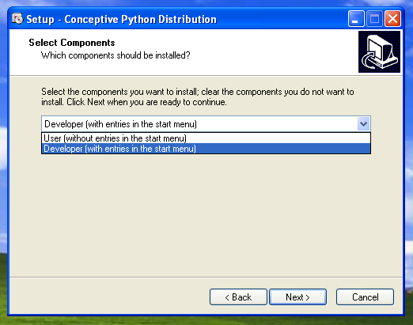

.. _doc-deployment:

#############
  Deployment
#############

:Release: |version|
:Date: |today|

After developing a Camelot application comes the need to deploy the
application, either at a central location or in a distributed setup.

Building .egg files
===================

Whatever the deployment setup is, it is almost always a good idea to
distribute your application as a single .egg file, containing as much
as possible the dependencies that are likely to change often during
the lifetime of the application.  Resource files (like icons or templates
can be included in this .egg file as well).

Building .egg files is a relatively straightforward process using 
setuptools_ 

A setup.py file for building an .egg of your application could look
like this::

	from setuptools import setup, find_packages

	setup(
	  name = 'movie store',
	  version = '01.01',
	  description = 'Movie Store',
	  author = 'Conceptive Engineering',
	  author_email = 'project-camelot@conceptive.be',
	  url = 'www.conceptive.be',
	  include_package_data = True,
	  packages = find_packages(),
	  py_modules =  ['settings'] )

Which is then build using this command::
	  
	python -O setup.py bdist_egg --exclude-source-files
	
The setup.py script above includes settings.py in the .egg file.  This
is prefered if the settings.py file is going to be the same for all 
deployments.  (Eg.: the database is on a central server accessible
for all)  In some occasions it might be better not to include the settings.py
file into the .egg file, and only put it in your PYTHONPATH at deployment
time. 

.. note::

	The advantage of using .egg files comes when updating the application, simply
	replacing a single .egg file at a central location is enough to migrate all
	your users to the new version.
	
	
Windows deployment
==================

Through CloudLaunch
-------------------

CloudLaunch is a service to ease the deployment and update process of Python
applications.  It's main features are :

  * Building Windows Installers
  * Updating deployed applications
  * Monitoring of deployed applications
  
As CloudLaunch is build on top of setuptools, it works with .egg files, 
CloudLaunch works cross platform, so it's perfectly possible to build a
Windows installer, or update a Windows application from Linux.

To build a .egg file that can be deployed through CloudLaunch, use the
command::

    python.exe setup.py bdist_cloud
    
This will create 2 files in the dist/cloud folder, a traditional .egg file and
a .cld file.  The .egg file is a normal .egg file with some additional metadata
included, and without sources.  The .cld file contains metadata of the .egg
file, such as its checksum, and information on how get updated versions of the
.egg once deployed.

To make sure the application will run smoothly once deployed, one should test
if the generated .egg and .cld combination works::

    cd dist\cloud
    cloudlaunch.exe --cld-file movie_store.cld
    cd ..\..
    
If this is working, a Windows installer can be build::

    python.exe setup.py bdist_cloud wininst_cloud
    
This will generate a movie_store.exe file in dist\cloud, which is an installer
for your application.  The end user can now install and run your application on
his machine.

Now is the time to monitor the application as it runs on the end user machine::

    python.exe setup.py monitor_cloud
    
Will display all the logs issued on the end user machine if that machine is
connected to the internet.

When development of the application continues, it will be needed to present the
user with an updated version of the application.  This is done with the 
command::

    python.exe setup.py bdist_cloud upload_cloud
    
This will send an updated .egg and .cld file to the central repository, where
the end-user application will check for updates.  If such an update is detected,
the application will download the new egg and run from that one.

Using .egg files
----------------

First of all python needs to be available on the machines that are going
to run the application.  The easies way to achieve this is by installing the
`Conceptive Python Distribution (CPD) <http://www.python-camelot.com/cpd.html>`_
on the target machine.  This Python distribution can be installed in 
**End user mode**, which means the user will not notice it is installed.

Notice that for python to be available, it not
necessarily needs to be installed on every machine that runs the application.
Installing python on a shared disk of a central server might just be enough.

Also put the .egg file on a shared drive.

Then, the easiest way to proceed is to put a little .vbs bootstrap script on
the shared drive and put shortcuts to it on the desktops of the users.  The
.vbs script can look like this::

	Set WshShell = WScript.CreateObject("WScript.Shell")
	WshShell.Environment("Process").item("PYTHONPATH") = "R:\movie_store-01.01-py2.7.egg;"
	WshShell.Run """C:\Program Files\CPD\pythonw.exe"" -m movie_store.main"

Linux deployment
================

The application can be launched by putting the .egg in the PYTHONPATH
and starting python with the -m option::

	export PYTHONPATH = /mnt/r/movie_store-01.01-py2.7.egg
	python.exe -m movie_store.main

Don't forget that all dependencies for your application should be installed
on the system or put in the PYTHONPATH
