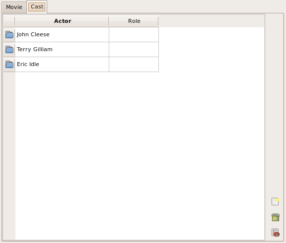
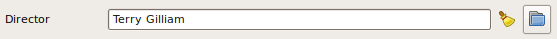

.. _doc-delegates:

####################
  Camelot Delegates
####################

:Release: |version|
:Date: |today|

:term:`Delegates <delegate>` are a cornerstone of the Qt model/view framework.
A delegate is used to display and edit data from a :term:`model`.

In the Camelot framework, every field of an :term:`Entity` has an associated
delegate that specifies how the field will be displayed and edited.  When a new
form or table is constructed, the delegates of all fields on the form or table
will construct :term:`editors <editor>` for their fields and fill them with
data from the model.  When the data has been edited in the form, the delegates
will take care of updating the model with the new data.

All Camelot delegates are subclasses of :class:`QAbstractItemDelegate`.

Default delegates
=================

All delegates can be found in :file:`camelot.view.controls.delegates.py`

Camelot assigns a default delegate based on the `SQLAlchemy <http://www.sqlalchemy.org/>`_
field type used in the model definition.  Some delegates take specific
arguments into account for their construction.  All :attr:`field_attributes`
specified for a certain field will be propagated towards the constructor of the
delegate.

**OneToMany**

OneToManyColumnDelegate

**ManyToOne**

ManyToOneColumnDelegate

**ManyToMany**

ManyToManyColumnDelegate

.. image:: ../_static/manytomany.png

**File**

FileDelegate

.. image:: ../_static/file_delegate.png

Forcing delegates
=================

The use of a specific delegate can be forced by using the ``delegate`` field
attribute.  Suppose ``rating`` is a field of type :ctype:`integer`, then it
can be forced to be visualized as stars::

	from camelot.view.controls import delegates
	...
	field_attributes = {'rating':{'delegate':delegates.StarDelegate}}

Attributes common to most delegates
===================================

**editable** :const:`True` or :const:`False`
  Indicates whether the user can edit the field.

**minimum, maximum**
  The minimum and maximum allowed values for :ctype:`Integer` and
  :ctype:`Float` delegates or their related delegates like the Star delegate.

**choices**
  A function taking as a single argument the object to which the field
  belongs.  The function returns a list of tuples containing for each
  possible choice the value to be stored on the model and the value
  displayed to the user.

  The use of :attr:`choices` forces the use of the ComboBox delegate::

	field_attributes = {'state':{'choices':lambda o:[(1, 'Active'),
	                                                 (2, 'Passive')]}}

Delegate specific attributes
============================

Float
-----

**precision**
  The number of digits after the decimal point displayed.  This defaults
  to the precision specified in the definition of the Field.

Text
----

**length**
  The number of characters displayed.  Defaults to the length allowed in
  the definition of the field. 

Time, Date and DateTime
-----------------------

**format**
  The format used to display time and date.  Defaults to ``'hh:mm'``,
  ``'dd-MM-yyyy'``, ``'dd-MM-yyyy hh:mm'``.
