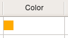

.. _howto-models:

#################################################
 Creating models with Elixir/Sqlalchemy/Camelot
#################################################

:Release: |version|
:Date: |today|

This section contains tips and tricks to build data models with Elixir/Sqlalchemy/Camelot.
The reader is encouraged to first read the basics tutorial.

Camelot field types
===================

Camelot extends the Sqlalchemy field types with a number of its own field types.  Those
field types are automatically mapped to a specific delegate taking care of the visualisation.

Those field types are defined in _camelot.types_

Code
----

Color
-----

The Color field returns and accepts tuples of the form (r,g,b,a) where
r,g,b,a are integers between 0 and 255.  The color is stored as an hexadecimal
string into the database::

	class MovieType(Entity):
	  color = Field(camelot.types.Color())

Enumeration
-----------

The enumeration field stores integers in the database, but represents them as
strings.  This allows efficient storage and querying while preserving readable code.

Typical use of this field would be a status field.

Enumeration fields are visualized as a combo box, where the labels in the combo
box are the capitalized strings::

	class Movie(Entity):
	  title = Field(Unicode(60), required=True)
	  state = Field(camelot.types.Enumeration([(1,'planned'), (2,'recording'), (3,'finished'), (4,'canceled')]), 
	                                          index=True, required=True, default='planning')

.. image:: ../_static/enumeration.png

File
----

The file field stores a filename, located within the settings.MEDIA_ROOT folder.  A subdirectory
upload_to can be specified::

  class Movie(Entity):
    script = Field(camelot.types.File(upload_to='script'))
    

IPAddress
---------

Image
-----

The Image field type provides the same functionallity as the File field type, but
the files stored should be images.

.. image:: ../_static/image.png

Rating
------

The rating field is an integer field that is visualized as a number of stars that
can be selected::

	class Movie(Entity):
	  title = Field(Unicode(60), required=True)
	  rating = Field(camelot.types.Rating())
	  
.. image:: ../_static/rating.png

RichText
--------

RichText fields are unlimited text fields which contain html.  The html will be
rendered in a rich text editor.  

.. image:: ../_static/richtext.png

VirtualAddress
--------------

A single field that can be used to enter phone numbers, fax numbers, email addresses, 
im addresses.  The editor provides soft validation of the data entered.  The address
or number is stored as a string in the database

Fields calculated by the database
=================================

Having certain summary fields of your models filled by the database has the advantage
that the heavy processing is moved from the client to the server.  Moreover if the 
summary builds on information in related records, having the database build the summary
reduces the need to transfer additional data from the database to the server.

To display fields in the table and the form view that are the result of a calculation 
done by the database, a ColumnProperty needs to be defined in the Elixir model.  In this 
ColumnProperty, the sql query can be defined using sqlalchemy statements.  Then use the 
field attributes mechanism to specify which delegate needs to be used to render the field.

.. image:: ../_static/budget.png

As an example we will create a budget with multiple budget lines, where the total budget 
is calculated by the database ::

	from elixir.properties import ColumnProperty
	from camelot.view.controls import delegates
	from sqlalchemy import sql, and_
	
	class Budget(Entity):
	  lines = OneToMany('BudgetLine')
	  total = ColumnProperty(lambda c:sql.select([sql.func.sum(BudgetLine.amount)], and_(BudgetLine.budget_id==Budget.id)))
	
	   class Admin(EntityAdmin):
	    name = 'Budgets'
	    list_display = [ 'total', 'lines']
	    field_attributes = {'total':{'delegate':delegates.FloatColumnDelegate}} 
	
	class BudgetLine(Entity):
	  budget = ManyToOne('Budget', required=True, ondelete='cascade', onupdate='cascade')
	  amount = Field(Float(precision=2), default=0)
	
	  class Admin(EntityAdmin):
	    name = 'Budget lines'
	    list_display = ['amount',] 
	    
When the user presses F9, all data in the application is refreshed from the database, and thus
all fields are recalculated.

An explanation of the lambda function inside the ColumnProperty can be found in the Elixir_ColumnProperty_ and
the Sqlalchemy_mappers_.

.._Elixir_ColumnProperty http://elixir.ematia.de/apidocs/elixir.properties.ColumnProperty.html

.._Sqlalchemy_mappers http://www.sqlalchemy.org/docs/04/mappers.html#advdatamapping_mapper_expressions

