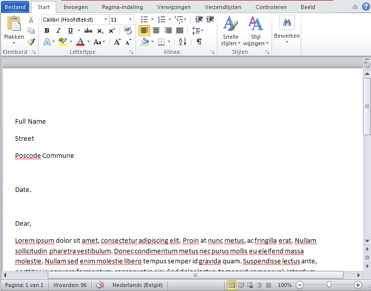
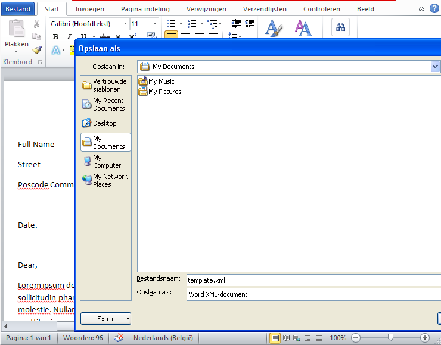

.. _tutorial-document-merge:

###########################
 Merging template documents
###########################

Camelot includes a wizard that allows savy users to merge their
own templates with a selection of objects.  This can be used to
create open xml documents, suited for MS Office.

Create a template document with MS Office
-----------------------------------------

Create a document using MS Office and with some placeholder text
on places where you want to insert data.

   
And save it as an xml file :

Clean the XML generated by MS Office
------------------------------------

The XML file generated by MS Office can be cleaned using **xmllint**::

	xmllint --format template.xml > template_clean.xml
	
Replace the placeholders
------------------------

The template will be merged with the objects in the selection using jinja,
where the object in the selection will be available as a variable named
**obj** and the time of merging the document is available as **now**:

Merge the document
------------------

.. image:: ../_static/mergedocumentwizard/wizard_widget.png