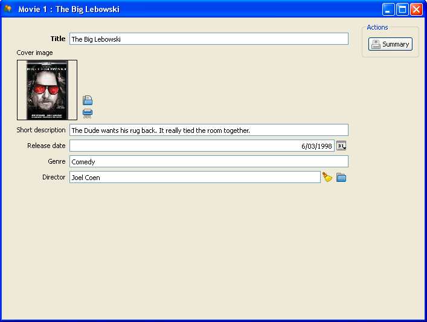
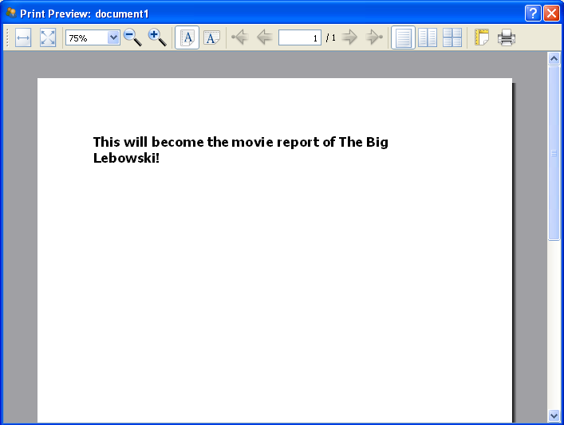
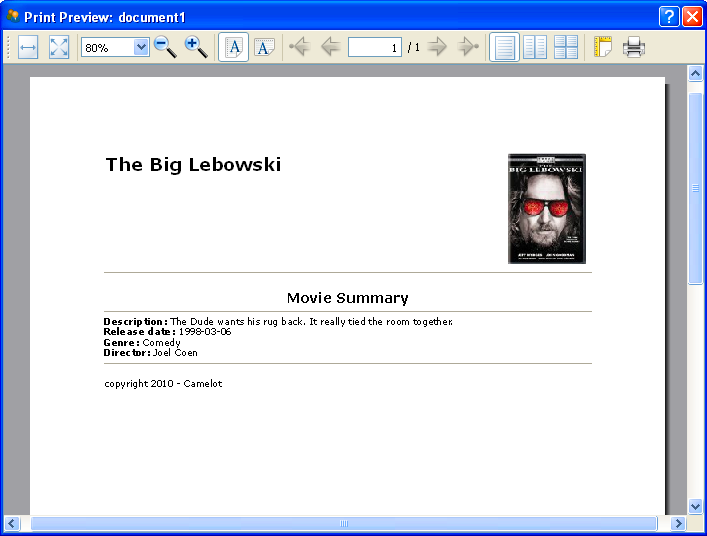

.. _tutorial-reporting:

###############################
 Creating a Report with Camelot
###############################

With the Movie Database Application as our starting point, we're going to use 
the reporting framework in this tutorial.  We will create a report of each 
movie, which we can access from the movie detail page.

Massaging the model
===================

First of all we need to create a button to access our report. This is easily 
done by specifying a form_action, right in the Admin subclass of the model. 
Our appended code will be::
 	
	form_actions = [MovieSummary()] 

The action is described in the MovieSummary class, which we'll discuss next. 
Note that it needs to imported, obviously::

	from movie_summary import MovieSummary

So the movie model admin will look like this::

	class Admin(EntityAdmin):
		from movie_summary import MovieSummary
		verbose_name = _('Movie')
		list_display = [
			'title',
			'short_description',
			'release_date',
			'genre',
			'director'
		]
		form_display = [
			'title',
			'cover_image',
			'short_description',
			'release_date',
			'genre',
			'director'
		]
		form_actions = [
			MovieSummary()
		]

The Summary class
=================
In the MovieSummary class, which is a child class of 
:class:`camelot.admin.action.base.Action`, we need to override just one method;
the :meth:`model_run` method, which has the `model_context` object as its 
argument.   This makes accessing the `Movie` object very easy as we'll see in a 
minute.  The `model_run` method will yield ..., have a guess.... Exactly, 
a print preview:

.. literalinclude:: ../../../../test/test_action.py
   :start-after: begin html print
   :end-before: end html print

You can already test this. You should see a button in the "Actions" section, on 
the right of the Movie detail page. Click this and a print preview should open 
with the text you let the html method return.

Now let's make it a bit fancier.

Using Jinja templates
=====================

Install and add Jinja2 to your PYTHONPATH. You can find it here: 
http://jinja.pocoo.org/2/ or at the cheeseshop 
http://pypi.python.org/pypi/Jinja2 . Now let's use its awesome powers.

First we'll make a base template. This will determine our look and feel for all 
the report pages.  This is basically html and css with block definitions. 
Later we'll create the page movie summary template which will contain our model 
data. The movie summary template will inherit the base template, and provide 
content for the aforementioned blocks.  The base template could look something 
like::

	<html>
	<head>
	  <title></title>
	  <meta http-equiv="Content-Type" content="text/html; charset=UTF-8" />
	  
	</head>
	<body>

	<table id="page_header" width="100%">
	  <tr>
	    <td><h1></h1></td>
	    <td align="right"></td>
	  </tr>
  
	</table>
	

	<h2 id="page_title">

</h2>
	

	
	

	


	</body>
	</html>

We'll save this file as base.html in a directory called templates in our 
videostore.  Like this base template, the movie summary template is html and 
css. Take a look at the example first::

	
	{{ style }}
	{{ title }}
	{{ title }}
	{{ header }}
	
	
		
	
		(no cover) 
		
	
	{{ content }}
	{{ footer }}

First we extend the base template, that way we don't need to worry about the 
boilerplate stuff, and keep our pages consistent, provided we create more 
reports of course.  We can now fill in the blanks, erm blocks from the base 
template. We do that with placeholders which we'll define in the html method of 
our MovieSummary class. This way we can even add style to the page::

	{{ style }}
	
We'll define this later. The templating language also allows basic flow 
control::

	
		
	
		(no cover) 
	

If there is no cover image, we'll show the string "(no cover)".
We'll save this file as movie_summary.html in the templates directory.

Like i said earlier, we now need to define which values will go in the 
placeholders, so let's update our html method in the MovieSummary class.
First, we import the needed elements::

	import datetime
	from jinja import Environment, FileSystemLoader
	from pkg_resources import resource_filename
	import videostore

We'll be printing a date, so we'll need datetime. The Jinja classes to make use 
of our templates. And to locate our templates, we'll use the resource module, 
with our videostore. And load up the Jinja environment ... ::

	fileloader = FileSystemLoader(resource_filename(videostore.__name__, 'templates'))
	e = Environment(loader=fileloader)

Now we need to create a context dictionary to provide data to the templates. 
The keys of this dictionary are the placeholders we used in our movie_summary 
template, the values we can use from the model, which is passed as the o 
argument in the html method::

	context = {
        'header':o.title,
        'title':'Movie Summary',
        'style':'.label { font-weight:bold; }',
        'content':'Description: %s \
                Release date: %s \
                Genre: %s \
                Director: %s'
                % (o.short_description, o.release_date, o.genre, o.director),
        'cover': os.path.join( resource_filename(videostore.__name__, 'media'), 'covers', o.cover_image.name ),
        'footer':' copyright %s - Camelot' % datetime.datetime.now().year
	}

Plain old Python dictionary. Check it out, we can even pass css in our setup.

Finally, we'll get the template from the Jinja environment and return the 
rendered result of our context::

	t = e.get_template('movie_summary.html')
	return t.render(context)

So our finished method eventually looks like this::

	from camelot.admin.action import Action
	
	class MovieSummary( Action ):
	
	    verbose_name = _('Summary')
	    
	    def model_run( self, model_context ):
                from camelot.view.action_steps import PrintHtml
	        import datetime
	        import os
	        from jinja import Environment, FileSystemLoader
	        from pkg_resources import resource_filename
	        import videostore
	        fileloader = FileSystemLoader(resource_filename(videostore.__name__, 'templates'))
	        e = Environment(loader=fileloader)
		movie = model_context.get_object()
	        context = {
	                'header':movie.title,
	                'title':'Movie Summary',
	                'style':'.label { font-weight:bold; }',
	                'content':'Description: %s \
	                        Release date: %s \
	                        Genre: %s \
	                        Director: %s'
	                        % (movie.short_description, movie.release_date, movie.genre, movie.director),
	                'cover': os.path.join( resource_filename(videostore.__name__, 'media'), 'covers', movie.cover_image.name ),
	                'footer':' copyright %s - Camelot' % datetime.datetime.now().year
	        }
	        t = e.get_template('movie_summary.html')
	        yield PrintHtml( t.render(context) )

What are you waiting for? Go try it out!  You should see something like this:

