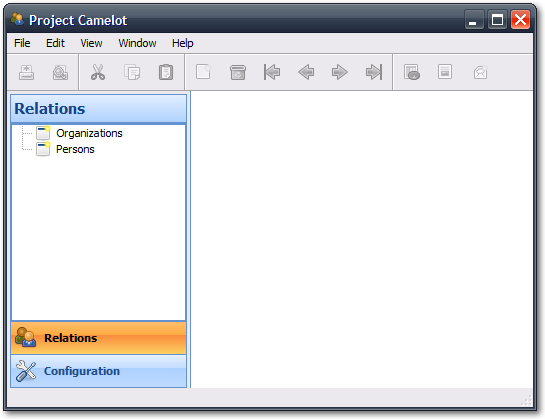

.. _tutorial-videostore:

########################################
 Creating a Movie Database Application
########################################

:Release: |version|
:Date: |today|

In this tutorial we will create a fully functional movie database application
with Camelot. We assume Camelot is properly :ref:`installed <doc-install>`.

Starting a New Project
======================

We begin with the creation of a new project. Typing the following command in
your favorite command prompt (or shell) creates one::

  python PTC\camelot\bin\camelot_admin.py startproject videostore

Under linux, you may have to adjust the folder separator. This tutorial has
been written under the Windows XP operating system. The pictures also reflect
that operating system.

`PTC` is the path to Camelot main directory. The folder :file:`videostore`
should appear in your the directory you are working in. We will be working the
Python modules created and put inside this directory.

Main Window and Views
=====================

:option:`camelot_admin.py` created some modules for us. Let's focus on the
one called :file:`main.py` which contains the entry point of your Camelot
application. If you launch it::

  python videostore\main.py

your `PyQt <http://www.riverbankcomputing.co.uk/software/pyqt/intro>`_
:abbr:`Graphical User Interface <GUI>` should look like the one we show in the
picture below:

The application has menus, a toolbar, a left navigation pane, and a central
area on which nothing is currently displayed.

The navigation pane has its first button selected. Select any other button by
clicking on it, and see the nagivation tree fill itself with new entries.
These are `entities`, and we will talk about them later.  (Generally speaking,
an `entity` represents a single table in a database.)

.. image:: ../_static/picture2.png

.. note::

   Camelot uses `sections` to group `models`.  Each button in the navigation
   pane represents a `section`, and each entry of the navigation tree is part
   of this section.

Notice that the application disables most of the menus and the toolbar
buttons. When we click on an entity, more options become available.
So let's click on the entity ``Persons`` of the section ``Relations``.

A child window appears in the previously empty area and is maximized by
default: this is the table view of the entity.

.. image:: ../_static/picture3.png

Each row is a record with some fields that we can edit (others might not be
editable). Let's now add a new row by clicking on the new icon (next to the
trash bin icon; which removes a row).

.. image:: ../_static/picture4.png

We now see a form view with additional fields. Forms are not maximized by
default. Forms label **required** fields in bold.

.. image:: ../_static/picture5.png

Fill in a first and last name, and close the form. Camelot will automatically
validate and echo the changes to the database. We can reopen the form by
clicking on the blue icon in the first column of each row of the table. Notice
also that there is now an entry in our table.

.. image:: ../_static/picture6.png

That's it for basic usages of the interface. Next we will write code for our
database model.

Creating the Movie Model
========================

Let's first take a look at the :file:`settings.py` in our project directory.
There is an attribute, ``ENGINE``, an anonymous function, which returns a
:abbr:`Uniform Resource Identifier URI`. That's the database your Camelot
application will be connecting too. Camelot provides a default ``sqlite`` URI
scheme. But you can set your own.

If you set a database file that does not exist it will be created in the
directory from which the application is *launched*.

Now we can look at :file:`model.py`. Camelot has already imported some classes
for us. They are used to create our entities. Let's say we want a movie entity
with a ``title``, a short ``description``, a ``release date``, and a
``genre``.

The aforementioned specifications translate into the following Python code,
that we add to our model.py module::

  class Movie(Entity):
    using_options(tablename='movie')

    title = Field(Unicode(60), required=True)
    short_description = Field(Unicode(512))
    release_date = Field(Date)
    genre = Field(Unicode(15))

``Movie`` inherits ``Entity`` from the `Elixir <http://elixir.ematia.de/trac/wiki>`_
library. We use ``using_options()`` to name the table ourselves. Elixir would
have used the location of our module to generate a name in the form
*package_model_entity*, as described `in Elixir documentation
<http://elixir.ematia.de/apidocs/elixir.options.html>`_.

Our entity holds four fields.

::

  title = Field(Unicode(60), required=True)

``title`` holds up to 60 unicode characters, and is required:

::

  short_description = Field(Unicode(512))

``short_description`` can hold up to 512 characters:

::

  release_date = Field(Date)
  genre = Field(Unicode(15))

``release_date`` holds a date, and ``genre`` up to 15 unicode characters:

For more information about defining fields, refer to
`this page <http://elixir.ematia.de/apidocs/elixir.fields.html>`_. The
different `SQLAlchemy <http://www.sqlalchemy.org>`_ types used by Elixir
are described `here <http://www.sqlalchemy.org/docs/04/types.html>`_.
Finally, Camelot fields are documented in the API.

Let's now create an ``EntityAdmin`` subclass

The EntityAdmin Subclass
========================

We have to tell Camelot about our entities, so they show up in the :abbr:`GUI`.
This is one of the purposes of ``EntityAdmin`` subclasses. After adding the
``EntityAdmin`` subclass, our ``Movie`` class now looks like this::

  class Movie(Entity):
    using_options(tablename='movie')

    title = Field(Unicode(60), required=True)
    short_description = Field(Unicode(512))
    release_date = Field(Date)
    genre = Field(Unicode(15))

    class Admin(EntityAdmin):
      verbose_name = 'Movie'
      list_display = ['title', 'short_description', 'release_date', 'genre']

    def __unicode__(self):
      return self.title or 'untitled movie'

We made ``Admin`` an inner class to strengthen the link between it and the
``Entity`` subclass. Camelot does not force us. ``Admin`` holds three
attributes.

``verbose_name`` will be the label used in navigation trees.

The last attribute is interesting; it holds a list containing the fields we
have defined above. As the name suggests, ``list_display`` tells Camelot to
only show the fields specified in the list. ``list_display`` does not affect
forms.

In our case we want to display four fields: ``title``, ``short_description``,
``release_date``, and ``genre`` (that is, all of them.)

We also add a ``__unicode__()`` method that will return either the title of the
movie entity or ``'untitled movie'`` if title is empty. This is a good
programming practice.

Let's move onto the last piece of the puzzle.

Configuring the Application
===========================

We are now working with :file:`application_admin.py`.  One of
the tasks of :file:`application_admin.py` is to specify the sections in
the left pane of the main window.

Camelot defined a class, ``MyApplicationAdmin``, for us. This class is a
subclass of ``ApplicationAdmin``, which is used to control the overall look
and feel of every Camelot application.

To change sections in the left pane of the main window, simply overwrite the
``get_sections`` method, to return a list of the desired sections.  By default
this method contains::

  def get_sections(self):
    from camelot.model.memento import Memento
    from camelot.model.authentication import Person, Organization
    from camelot.model.i18n import Translation
    return [Section('relation',
                    Icon('tango/24x24/apps/system-users.png'),
                    items = [Person, Organization]),
            Section('configuration',
                    Icon('tango/24x24/categories/preferences-system.png'),
                    items = [Memento, Translation])
            ]
            
which will display two buttons in the navigation pane, labelled ``'Relations'``
and ``'Configurations'``, with the specified icon next to each label. And yes,
the order matters.

We need to add a new section for our ``Movie`` entity, this is done by
extending the list of sections returned by the ``get_sections`` method with a
Movie section::

	Section('movies',
            Icon('tango/24x24/mimetypes/x-office-presentation.png'),
            items = [Movie])

The constructor of a section object takes the name of the section, the icon to
be used and the items in the section.  The items is a list of the entities for
which a table view should shown. 

Camelot comes with the `Tango <http://tango.freedesktop.org/Tango_Icon_Library>`_
icon collection; we use a suitable icon for our movie section.

The resulting method now becomes::

  def get_sections(self):
    from camelot.model.memento import Memento
    from camelot.model.authentication import Person, Organization
    from camelot.model.i18n import Translation    
    from example.model import Movie
    return [Section('movies', 
                    Icon('tango/24x24/mimetypes/x-office-presentation.png'),
                    items = [Movie]),
            Section('relation',
                    Icon('tango/24x24/apps/system-users.png'),
                    items = [Person, Organization]),
            Section('configuration',
                    Icon('tango/24x24/categories/preferences-system.png'),
                    items = [Memento, Translation])
            ]
    
We can now try our application.

We see a new button the navigation pane labelled `'Movies'`. Clicking on it
fills the navigation tree with the only entity in the movies's section.
Clicking on this tree entry opens the table view. And if we click on the blue
folder of each record, a form view appears as shown below.

.. image:: ../_static/picture7.png

That's it for the basics of defining an entity and setting it for display in
Camelot. Next we look at relationships between entities.

Relationships
=============

We will be using Elixir's special fields ``ManyToOne`` and ``OneToMany`` to
specify relationships between entities. But first we need a ``Director``
entity. We define it as follows::

  class Director(Entity):
    using_options(tablename='director')

    name = Field(Unicode(60))
    movies = OneToMany('Movie')

Once again, we name the table ourselves. What's new here is ``OneToMany``.

In Elixir, ``OneToMany`` is a relationship; it takes as parameter the related
class's name. Behind the scenes, Elixir creates a director id column in the
table represented by the entity ``Movie`` and set a foreign key constraint on
this column.

Elixir requires that we add an inverse relationship ``ManyToOne`` to our
``Movie`` entity. It ends up looking as follows::

  class Movie(Entity):
    using_options(tablename='movie')

    title = Field(Unicode(60), required=True)
    short_description = Field(Unicode(512))
    release_date = Field(Date)
    genre = Field(Unicode(15))
    director = ManyToOne('Director')

    class Admin(EntityAdmin):
      verbose_name = 'Movie'
      list_display = ['title',
                      'short_description',
                      'release_date',
                      'genre',
                      'director']

    def __unicode__(self):
      return self.title or 'untitled movie'

We also inserted ``'director'`` in ``list_display``.

Our ``Director`` entity needs an administration class, which will adds the
entity to the section ``'movies'``. We will also add ``__unicode__()`` method
as suggested above. The entity now looks as follows::

  class Director(Entity):
    using_options(tablename='director')

    name = Field(Unicode(60))
    movies = OneToMany('Movie')

    class Admin(EntityAdmin):
      verbose_name = 'Director'
      list_display = ['name']

    def __unicode__(self):
      return self.name or 'unknown director'

For completeness the two entities are once again listed below::

  class Movie(Entity):
    using_options(tablename='movie')

    title = Field(Unicode(60), required=True)
    short_description = Field(Unicode(512))
    release_date = Field(Date)
    genre = Field(Unicode(15))
    director = ManyToOne('Director')

    class Admin(EntityAdmin):
      verbose_name = 'Movie'
      list_display = ['title',
                      'short_description',
                      'release_date',
                      'genre',
                      'director']

    def __unicode__(self):
      return self.title or 'untitled movie'

  class Director(Entity):
    using_options(tablename='director')

    name = Field(Unicode(60))
    movies = OneToMany('Movie')

    class Admin(EntityAdmin):
      verbose_name = 'Director'
      list_display = ['name']

    def __unicode__(self):
      return self.name or 'unknown director'

The last step is to fix :file:`application_admin.py` by adding the following
lines to the Director entity to the Movie section::

	Section('movies', 
            Icon('tango/24x24/mimetypes/x-office-presentation.png'),
            items = [Movie, Director])

This takes care of the relationship between our two entities. Below is the new
look of our video store application.

.. image:: ../_static/picture8.png

We have just learned the basics of Camelot, and have a nice movie database
application we can play with. In another tutorial, we will learn more advanced
features of Camelot.
