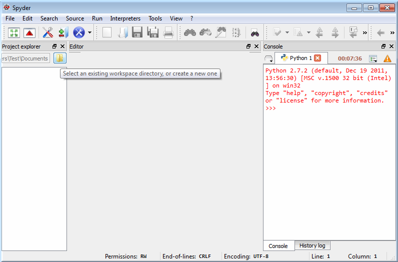
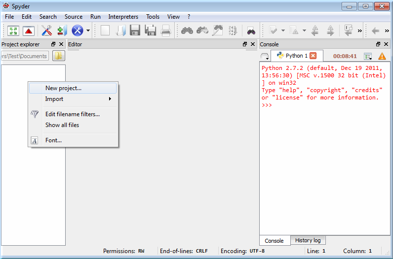
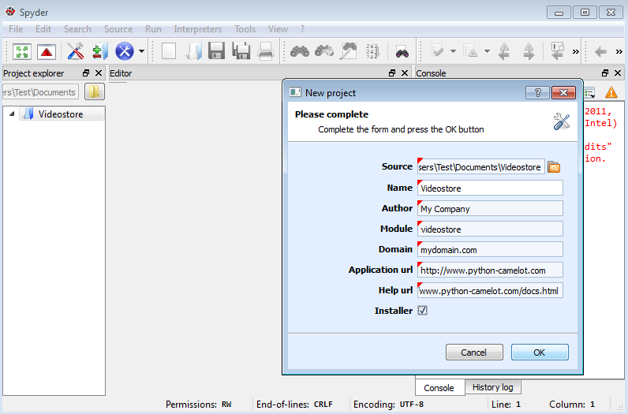
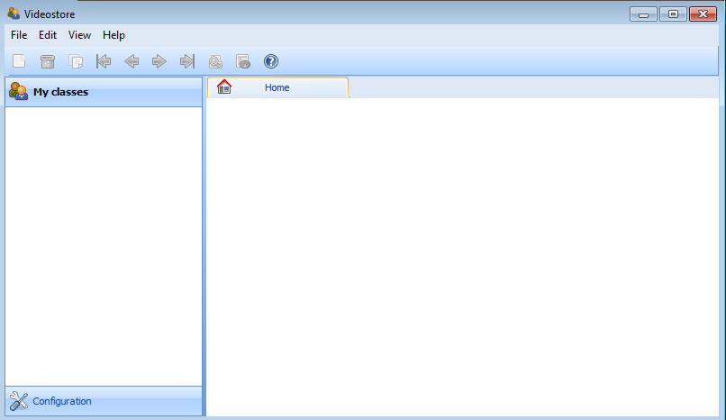
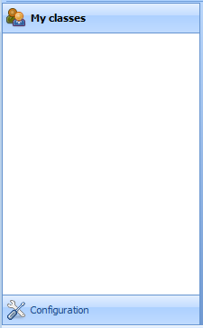
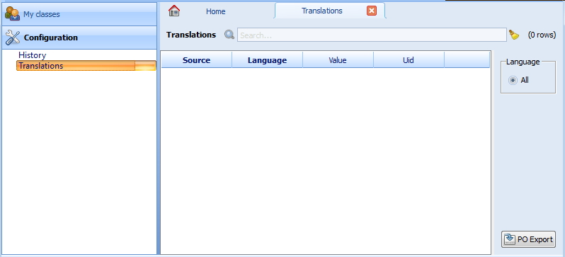
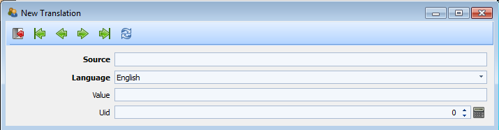
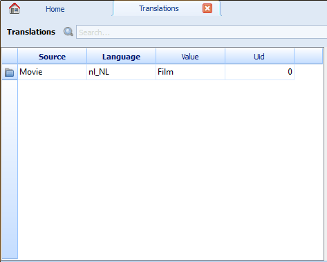
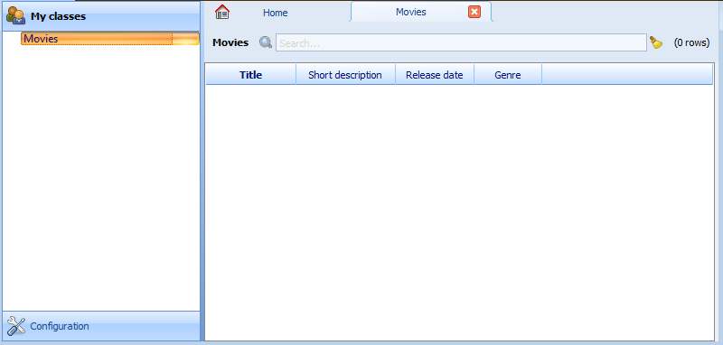

.. _tutorial-videostore:

########################################
 Creating a Movie Database Application
########################################

In this tutorial we will create a fully functional movie database application
with Camelot. We assume Camelot is properly :ref:`installed <doc-install>`.
An all in one installer for Windows is available as an SDK to develop Camelot
applications `(Python SDK) <http://www.conceptive.be/python-sdk.html>`_.

Setup Spyder
============

In this section, we will explain how to setup the **Spyder IDE** for developing
a **Camelot** project.  If you are not using **Spyder**, you can skip this and
jump to the next :ref:`section <start-project>`.

:menuselection:`Start --> All Programs --> Python SDK --> Spyder`

Within **Spyder**, open the *Project Explorer* : 

:menuselection:`View --> Windows and toolbars --> Project explorer`

In the *Project Explorer* change the workspace directory, to the directory where
you want to put your **Camelot** Projects. 

Next, still in the *Project Explorer*, right click to create a new project using :

:menuselection:`New Project`

Enter `Videostore` as the project name.

.. _start-project:

Starting a new Camelot project
==============================

We begin with the creation of a new **Camelot** project, using the `camelot_admin` tool : 

:menuselection:`Start --> All Programs --> Python SDK --> New Camelot Application`

.. note::

    From the command prompt (or shell), go to the directory in which the new project should be created.
    Type the following command::

        python -m camelot.bin.camelot_admin

A dialog appears where the basic information of the application can be filled in.
Select the newly created `Videostore` directory as the location of the source code.

Press `OK` to generate the source code of the project.
The source code should now appear in the selected directory.

Main Window and Views
=====================

To run the application, double click on the :file:`main.py` file in **Spyder**, which contains the entry point of your **Camelot** application and run this file. 

:menuselection:`Run --> Run --> Ok`

.. note::

    From the command prompt, simply start the script ::

        python main.py

your `Qt <http://www.qt-project.org>`_ GUI should look like the one we show in the picture below:

The application has a customizable menu and toolbar, a left navigation pane, and a central
area, where default the `Home` tab is opened, on which nothing is currently displayed.

The navigation pane has its first `section` expanded. 

The navigation pane uses `Sections` to group `Actions`.  
Each button in the navigation pane represents a `Section`, and each entry of the navigation tree is an `Action`.
Most standard `Actions` open a single table view of an `Entity` in a new tab. 

Notice that the application disables most of the menus and the toolbar
buttons. When we open a table view, more options become available.

Entities are opened in the active tab, unless
they are opened by selecting `Open in New Tab` from the context menu (right click) 
of the entity link, which will obviously open a new tab to right.
Tabs can be closed by clicking the `X` in the tab itself.

Each row is a record with some fields that we can edit (others might not be
editable). Let's now add a new row by clicking on the new icon (icon farthest the 
the left in the toolbar above the navigation pane).

We now see a new window, containing a form view with additional fields. 
Forms label **required** fields in bold.

Fill in a first and last name, and close the form. Camelot will automatically
validate and echo the changes to the database. We can reopen the form by
clicking on the blue folder icon in the first column of each row of the table. Notice
also that there is now an entry in our table.

That's it for basic usages of the interface. Next we will write code for our
database model.

Creating the Movie Model
========================

Let's first take a look at the :file:`main.py` in our project directory.  
It contains a `my_settings` object which is appended to the global `settings`.
The :ref:`settings` object contains the global configuration for things such as database and file location.

.. literalinclude:: ../../../../new_project/main.py
   :start-after: begin custom settings
   :end-before: end custom settings
   
Now we can look at :file:`model.py`. Camelot has already imported some classes
for us. They are used to create our entities. Let's say we want a movie entity
with a ``title``, a short ``description``, a ``release date``, and a
``genre``.

The aforementioned specifications translate into the following Python code,
that we add to our :file:`model.py` module::

  from sqlalchemy import Unicode, Date
  from sqlalchemy.schema import Column
  from camelot.core.orm import Entity
  from camelot.admin.entity_admin import EntityAdmin
  
  class Movie( Entity ):
    
      __tablename__ = 'movie'
    
      title = Column( Unicode(60), nullable = False )
      short_description = Column( Unicode(512) )
      release_date = Column( Date() )
      genre = Column( Unicode(15) )

.. note::

   The complete source code of this tutorial can be found in the
   :file:`camelot_example` folder of the Camelot source code.
   
:class:`Movie` inherits :class:`Entity`.  :class:`camelot.core.orm.Entity`` is the declarative base class for all objects that should be stored in the database.  
We use the ``__tablename__`` attribute to to name the table ourselves in which the data will be stored, otherwise a default tablename would have been used.

Our entity holds four fields that are stored in columns in the table.

::

  title = Column( Unicode(60), nullable = False )

``title`` holds up to 60 unicode characters, and cannot be left empty:

::

  short_description = Column( Unicode(512) )

``short_description`` can hold up to 512 characters:

::

  release_date = Column( Date() )
  genre = Column( Unicode(15) )

``release_date`` holds a date, and ``genre`` up to 15 unicode characters:

For more information about defining models, refer to the `SQLAlchemy Declarative extension <http://docs.sqlalchemy.org/en/rel_0_7/orm/extensions/declarative.html>`_. 

The different `SQLAlchemy <http://www.sqlalchemy.org>`_ column types used are described `here <http://docs.sqlalchemy.org/en/rel_0_7/core/types.html>`_.
Finally, custom Camelot fields are documented in the section :ref:`camelot-column-types`.

Let's now create an :class:`EntityAdmin` subclass

The EntityAdmin Subclass
========================

We have to tell Camelot about our entities, so they show up in the 
:abbr:`GUI (Graphical User Interface)`.
This is one of the purposes of :class:`camelot.admin.entity_admin.EntityAdmin` 
subclasses. After adding the ``EntityAdmin`` subclass, our ``Movie`` class now 
looks like this::

  class Movie( Entity ):
    
      __tablename__ = 'movie'
    
      title = Column( Unicode(60), nullable = False )
      short_description = Column( Unicode(512) )
      release_date = Column( Date() )
      genre = Column( Unicode(15) )

      def __unicode__( self ):
          return self.title or 'Untitled movie'

      class Admin( EntityAdmin ):
          verbose_name = 'Movie'
          list_display = ['title', 'short_description', 'release_date', 'genre']

We made ``Admin`` an inner class to strengthen the link between it and the
``Entity`` subclass. Camelot does not force us. Assign your ``EntityAdmin``
class to the ``Admin`` ``Entity`` member to put it somewhere else. 

``verbose_name`` will be the label used in navigation trees.

The last attribute is interesting; it holds a list containing the fields we
have defined above. As the name suggests, ``list_display`` tells Camelot to
only show the fields specified in the list. ``list_display`` fields are also
taken as the default fields to show on a form.

In our case we want to display four fields: ``title``, ``short_description``,
``release_date``, and ``genre`` (that is, all of them.)

The fields displayed on the form can optionally be specified too in the ``form_display``
attribute.

We also add a ``__unicode__()`` method that will return either the title of the
movie entity or ``'Untitled movie'`` if title is empty.  The ``__unicode__()``
method will be called in case Camelot needs a textual representation of an 
object, such as in a window title.

Let's move onto the last piece of the puzzle.

Configuring the Application
===========================

We are now working with :file:`application_admin.py`.  
One of the tasks of :file:`application_admin.py` is to specify the sections in the left pane of the main window.

Camelot defined a class, ``MyApplicationAdmin``, for us. 
This class is a subclass of :class:`camelot.admin.application_admin.ApplicationAdmin`, which is used to control the overall look and feel of every Camelot application.

To change sections in the left pane of the main window, simply overwrite the ``get_sections`` method, to return a list of the desired sections.  
By default this method contains::

    def get_sections(self):
        from camelot.model.memento import Memento
        from camelot.model.i18n import Translation
        return [ Section( _('My classes'),
                          self,
                          Icon('tango/22x22/apps/system-users.png'),
                          items = [] ),
                 Section( _('Configuration'),
                          self,
                          Icon('tango/22x22/categories/preferences-system.png'),
                          items = [Memento, Translation] )
                ]
            
which will display two buttons in the navigation pane, labelled ``'My classes'``
and ``'Configurations'``, with the specified icon next to each label. And yes,
the order matters.

We need to add a new section for our ``Movie`` entity, this is done by
extending the list of sections returned by the ``get_sections`` method with a
Movie section::

        from videostore.model import Movie
        return [ Section( _('Movie'),
                          self,
                          Icon('tango/22x22/apps/system-users.png'),
                          items = [Movie] ),
                 Section( _('Configuration'),
                          self,
                          Icon('tango/22x22/categories/preferences-system.png'),
                          items = [Memento, Translation] )
                ]

The constructor of a section object takes the name of the section, a reference
to the application admin object, the icon to be used and the items in the 
section.  The items is a list of the entities for which a table view should 
shown. 

Camelot comes with the `Tango <http://tango.freedesktop.org/Tango_Icon_Library>`_
icon collection; we use a suitable icon for our movie section.
    
We can now try our application.

We see a new button the navigation pane labelled `'Movies'`. Clicking on it
fills the navigation tree with the only entity in the movies's section.
Clicking on this tree entry opens the table view. And if we click on the blue
folder of each record, a form view appears as shown below.

That's it for the basics of defining an entity and setting it for display in
Camelot. Next we look at relationships between entities.

Relationships
=============

We will be using SQLAlchemy's :mod:`sqlalchemy.orm.relationship` API.  We'll
relate a director to each movie.  So first we need a ``Director`` entity. We 
define it as follows::
                   
    class Director( Entity ):
    
        __tablename__ = 'director'
  
        name = Column( Unicode( 60 ) )

Even if we define only the ``name`` column, Camelot adds an ``id`` column
containing the primary key of the ``Director`` Entity.  It does so because we
did not define a primary key ourselves.  This primary key is an integer number,
unique for each row in the ``director`` table, and as such unique for each 
``Director`` object.

Next, we add a reference to this primary key in the movie table, this is called
the foreign key.  This foreign key column, called ``director_id`` will be an 
integer number as well, with the added constraint that it can only contain
values that are present in the ``director`` table its ``id`` column.

Because the ``director_id`` column is only an integer, we need to add the
``director`` attribute of type ``relationship``.  This will allow us to use
the ``director`` property as a ``Director`` object related to a ``Movie``
object.  The ``relationship`` attribute will find out about the ``director_id``
column and use it to attach a ``Director`` object to a ``Movie`` object ::

    from sqlalchemy.schema import ForeignKey
    from sqlalchemy.orm import relationship
  
    class Movie( Entity ):
	
	__tablename__ = 'movie'
	
	title = Column( Unicode( 60 ),  nullable = False )
	short_description = Column( Unicode( 512 ) )
	release_date = Column( Date() )
	genre = Column( Unicode( 15 ) )
	
	director_id = Column( Integer, ForeignKey('director.id') )
	director = relationship( 'Director' )
      
	class Admin( EntityAdmin ):
	    verbose_name =  'Movie'
	    list_display = [ 'title',
			     'short_description',
			     'release_date',
			     'genre',
			     'director' ]
      
	def __unicode__( self ):
	    return self.title or 'untitled movie'

We also inserted ``'director'`` in ``list_display``.

To be able to have the movies accessible from a director, a ``relationship`` is
defined on the ``Director`` entity as well.  This will result in a ``movies``
attribute for each director, containing a list of movie objects.

Our ``Director`` entity needs an administration class as well. We will also 
add ``__unicode__()`` method as suggested above. The entity now looks as 
follows::

    class Director( Entity ):
	__tablename__ = 'director'
    
	name = Column( Unicode(60) )
	movies = relationship( 'Movie' )
    
	class Admin( EntityAdmin ):
	    verbose_name = 'Director'
	    list_display = [ 'name' ]
    
	def __unicode__(self):
	    return self.name or 'unknown director'

.. note::

   Whenever the model changes, the database needs to be updated.  
   This can be done by hand, or by dropping and recreating the database (or deleting the sqlite file).
   By default Camelot stores the data in an local directory specified by the operating system.
   Look in the startup logs to see where they are stored on your system, look for a line like ::
   
	[INFO   ] [camelot.core.conf] - store database and media in /home/username/.camelot/videostore
	
   To simply add columns and tables, the function :func:`camelot.core.sql.update_database_from_model`
   can be used.
   
For completeness the two entities are once again listed below::

    class Movie( Entity ):
	
	__tablename__ = 'movie'
	
	title = Column( Unicode( 60 ), nullable = False )
	short_description = Column( Unicode( 512 ) )
	release_date = Column( Date() )
	genre = Column( Unicode( 15 ) )
	
	director_id = Column( Integer, ForeignKey('director.id') )
	director = relationship( 'Director' )
      
	class Admin( EntityAdmin ):
	    verbose_name =  'Movie'
	    list_display = [ 'title',
			     'short_description',
			     'release_date',
			     'genre',
			     'director' ]
      
	def __unicode__( self ):
	    return self.title or 'untitled movie'

    class Director( Entity ):
	__tablename__ = 'director'
    
	name = Column( Unicode(60) )
	movies = relationship( 'Movie' )
    
	class Admin( EntityAdmin ):
	    verbose_name = 'Director'
	    list_display = [ 'name' ]
    
	def __unicode__(self):
	    return self.name or 'unknown director'

The last step is to fix :file:`application_admin.py` by adding the following
lines to the Director entity to the Movie section::

	Section( 'Movies', 
		 self,
                 Icon( 'tango/22x22/mimetypes/x-office-presentation.png' ),
                 items = [ Movie, Director ])

This takes care of the relationship between our two entities. 

We have just learned the basics of Camelot, and have a nice movie database
application we can play with. In another tutorial, we will learn more advanced
features of Camelot.
